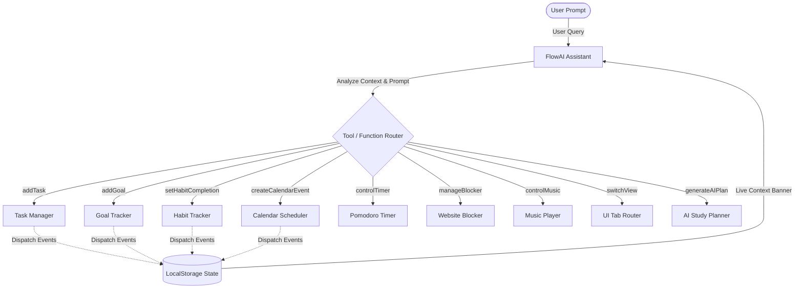
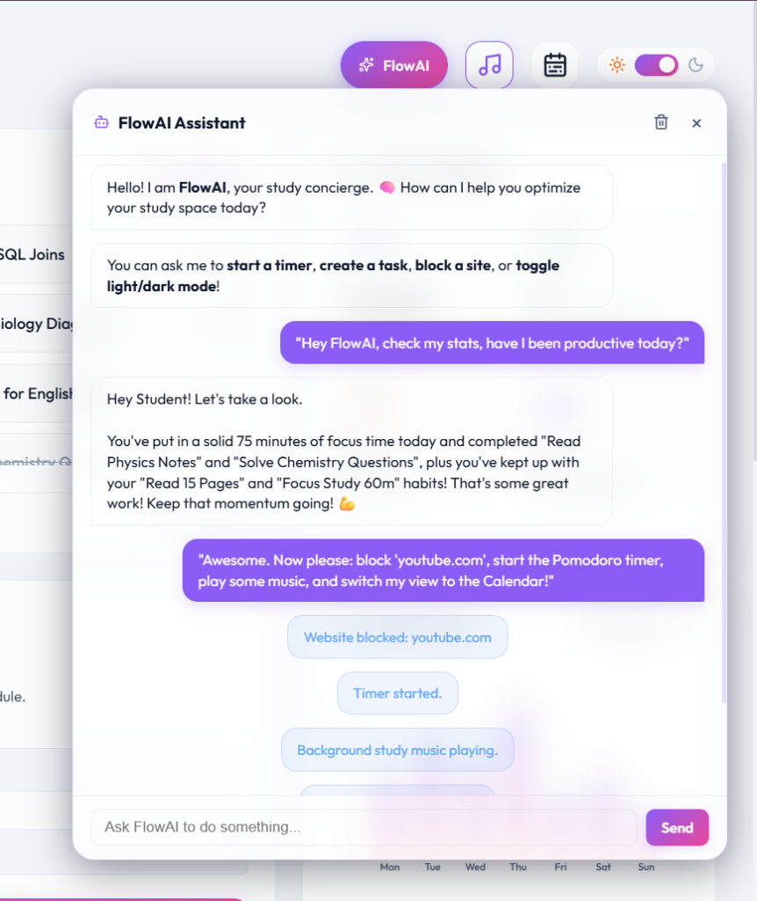
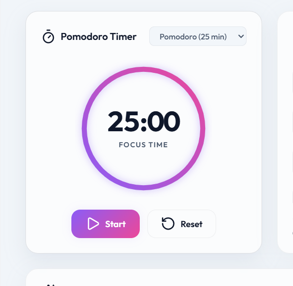
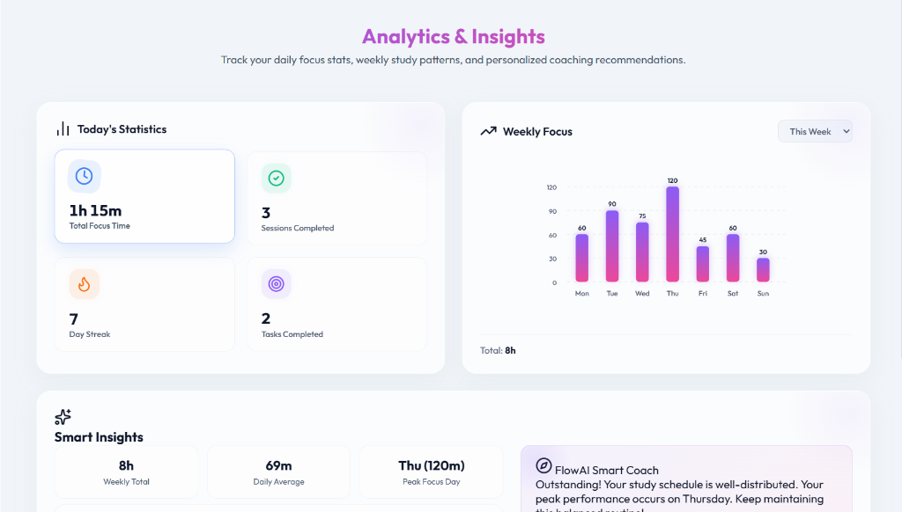
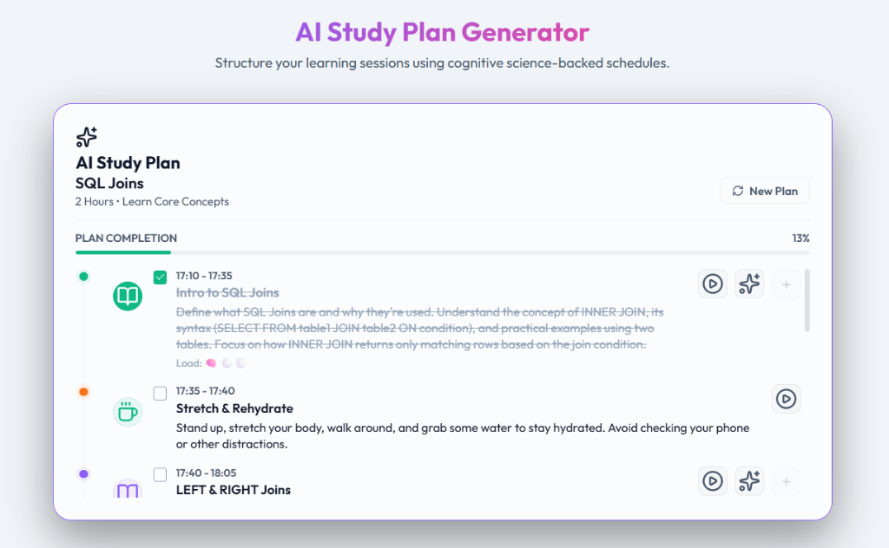
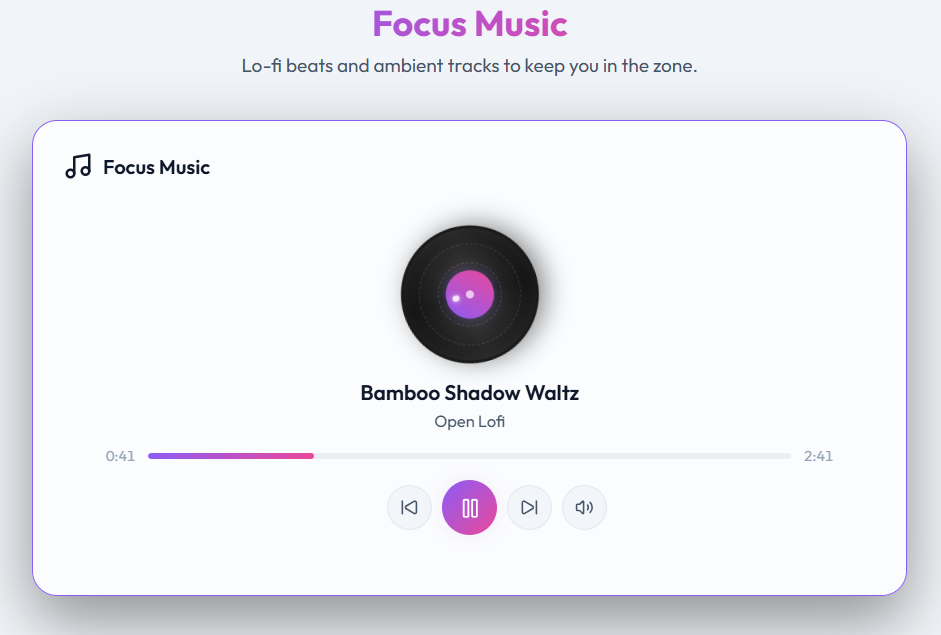
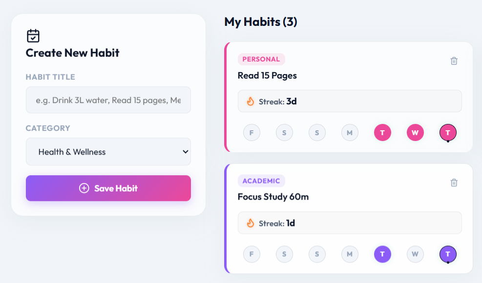
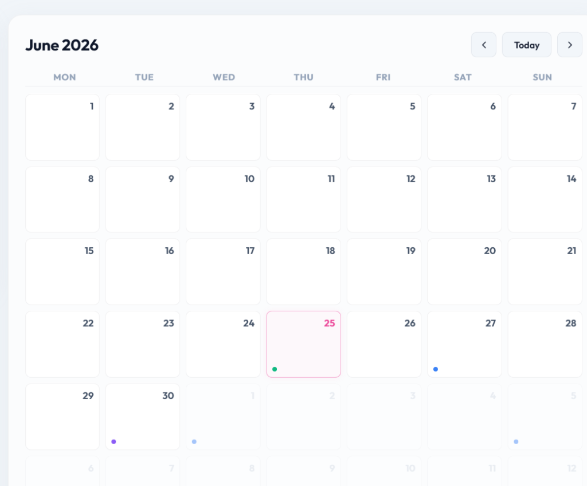
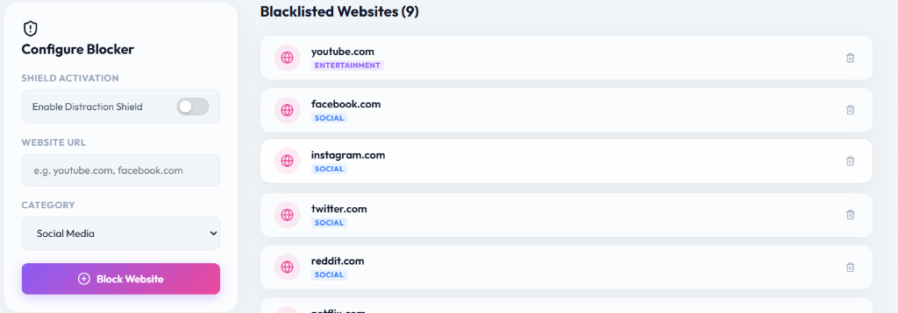

# FocusFlow 🧠
> **An Immersive Glassmorphic Productivity Dashboard & AI Concierge Agent**

FocusFlow is an interactive, browser-based productivity dashboard and personal concierge agent built for the **Kaggle 5-Day AI Agents Capstone Project**. It blends a sleek dark-mode glassmorphic user interface with **FlowAI**, a context-aware Gemini 2.5 Flash workspace co-pilot that can read your study statistics and directly control the browser dashboard through tool calling.

---

## 🔗 Project Resources

*   **⚡ Live Dashboard:** [https://omhari-kaushik.github.io/FocusFlow/](https://omhari-kaushik.github.io/FocusFlow/)
*   **🎥 Demo Video (5 mins):** [Insert Your YouTube Video Link Here]
*   **📂 Kaggle Writeup:** [Insert Your Kaggle Writeup Link Here]

---

## 🧠 FlowAI: Agent Architecture & Core Concepts

This project showcases the primary concepts taught in the Google & Kaggle AI Agents course:

### 1. Dynamic Live Context Binding
FlowAI is completely situated in the workspace. Every time you send a chat message, the system calls `getSystemInstruction()` to read the state of your local database (`localStorage`) in real-time, including:
*   Your name, study streak, and total focus sessions completed.
*   The exact list of pending and completed tasks.
*   Your active goals, milestones progress, and calendar events.
*   This week's focus time compared to last week's focus time.

### 2. UI-Bound Function & Tool Calling
FlowAI is equipped with a schema mapping containing **14 separate custom functions** mapped directly to the Gemini API (`TOOLS_CONFIG` in `js/assistant.js`). When you instruct the agent, it routes actions to:
*   **Tasks, Goals, Habits, Calendar:** Full CRUD control over your dashboard workflows.
*   **System Controls:** Toggling light/dark mode theme, skip/pause ambient lo-fi music, and programmatically switching sidebar tab panels.
*   **Distraction Guard:** Toggling the master website blocker shield on/off and adding/deleting blacklisted domains.

---

## 🌟 Core Features

1.  **AI Capsule Trigger & Chat** – Relocated to the top-right header actions. It is styled as a sleek, outlines-matched capsule button with a sparkles icon that glows with the signature purple-pink gradient when active.
    
    

      
📷 View Screenshot

       
      
    

2.  **Circular Pomodoro Timer** – Pomodoro, Short Break, and Long Break configurations with a circular progress ring, chime alerts, and visual bounce notifications.
    
    

      
📷 View Screenshot

       
      
    

3.  **Daily & Weekly Analytics** – Rolling session counters, focus summaries, and a custom SVG weekly bar chart with animated height updates.
    
    

      
📷 View Screenshot

       
      
    

4.  **AI Study Plan Generator** – Builds structured, hour-by-hour schedules based on cognitive science (alternating focus and rest blocks) with simulated loader status updates.
    
    

      
📷 View Screenshot

       
      
    

5.  **Focus Music Player** – Pre-packaged local lo-fi tracks, volume sliders, and a spinning vinyl record art piece with realistic motion markers and light sheen reflections.
    
    

      
📷 View Screenshot

       
      
    

6.  **Goal & Habit Trackers** – Milestone check-ins, habit streak calendars, and auto-recalculated completion indicators.
    
    

      
📷 View Screenshot

       
      
    

7.  **Workspace Calendar** – Aggregates and overlays goal deadlines, study plans, and custom schedule events.
    
    

      
📷 View Screenshot

       
      
    

8.  **Distraction Shield (Chrome Extension)** – Companion Manifest V3 extension that intercepts distracting domains globally and redirects you back to your workspace.
    
    

      
📷 View Screenshot

       
      
    

---

## 🛡️ Distraction Shield Chrome Extension Setup

The Website Blocker relies on a custom companion Chrome extension to intercept domains. Because the extension is packaged locally, it must be loaded as an unpacked developer extension:

### Quick Installation Steps
1.  Download or clone this repository to your computer.
2.  Open Google Chrome and navigate to `chrome://extensions/`.
3.  Toggle **Developer mode** (top-right corner) to **ON**.
4.  Click **Load unpacked** (top-left corner).
5.  Select the `focusflow-extension` folder inside this project directory.
6.  *The extension is now successfully installed!* Pin it to your browser to watch it sync.

### How to Test It
1.  Open **FocusFlow** in your browser (local or deployed link).
2.  Go to the **Website Blocker** tab.
3.  Toggle the master shield switch to **ON**.
4.  Enter `youtube.com` and click **Block Site**.
5.  Open a new tab and try to visit YouTube. You will be redirected to the motivational intercept page!

---

## ⚙️ Google Gemini AI Setup

To enable FlowAI's live chat intelligence:
1.  Go to Google AI Studio and obtain a **free Gemini API Key**.
2.  Open FocusFlow, navigate to **Settings** in the sidebar, and paste your key.
3.  Click **Save Settings** and verify with **Test Connection**.

---

## 🚀 Run the Project Locally

No node installations or heavy frameworks are required. FocusFlow runs entirely on vanilla HTML5, CSS3, and JavaScript:
*   **VS Code:** Install the **Live Server** extension, open the project folder, and click **Go Live**.
*   **Python:** Run `python -m http.server 8080` and navigate to `http://localhost:8080`.
*   **NodeJS:** Run `npx http-server` for byte-range support.

---

## 📄 License
Distributed under the MIT License. See `LICENSE` for details.
